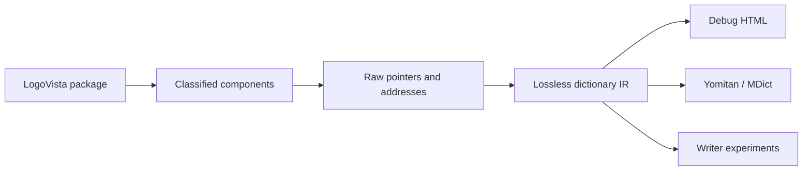

# logovista-tools

`logovista-tools` is a raw-first reverse-engineering toolkit for
LogoVista/SystemSoft SSED dictionary packages.

The project started as an exporter experiment. It is now aimed at a stronger
goal: building a lossless, evidence-backed model of LogoVista dictionaries so
the same understanding can support inspection, extraction, validation,
exporters, and eventually writer experiments.

No dictionary data is included in this repository.



## Status

**Research alpha.** This does not mean "barely works." It means the toolkit
already handles many observed dictionaries, but the model and output schemas
are still allowed to change as more products are tested.

| Layer | Current confidence |
|---|---|
| `SSEDINFO` / `SSEDDATA` expansion | High for observed SSED dictionaries |
| EPWING-like component block mapping | High |
| Body-stream `HONMON.DIC` extraction | High for supported dictionaries |
| Dense HONMON ID-anchor dereferencing | Strong, still corpus-driven |
| `*INDEX.DIC` / `*TITLE.DIC` parsing | High for the current SSED corpus |
| `.uni`, `GA16HALF`, `GA16FULL` gaiji resources | High for observed variants |
| `MENU.DIC`, `COLSCR.DIC`, `PCMDATA.DIC` | High byte coverage for the current SSED corpus |
| Windows / Android / iOS wrappers | Supported per observed package family |
| LVED/WebView2 `main.data` / `.dbc` SQLCipher payloads | Separate deferred package family; validated for observed OXFPEU4/KQCMPROS packages |
| LVLMultiView SQLite packages | Separate deferred package family; classified for observed ESPRANT2/YROPPO/MOROKU packages |
| SIZK read-aloud HTML/audio packages | Supported for the observed 30-package NHK set |
| LogoVista writer support | Not implemented |

The current development direction is:

1. keep package classification raw-first and evidence-backed;
2. count and expose unknowns instead of hiding them;
3. promote the current lossless span JSONL into a documented, stable IR;
4. use exporters and writer experiments as views over that model.

See [Project Status and Roadmap](docs/status.md) for the longer capability list.

The current authoritative corpus harness is `dump-package-models`. A
path-aware, resumable, chunked model pass over the local LogoVista collection
completed 261 package targets with zero failures:

```text
SSED packages:          202
LVED SQLCipher:          45
LVLMultiView SQLite:     14
decoded model failures:   0
```

The resulting capability matrix is derived from Decoded LogoVista Model v0
reports rather than recombining older command-specific outputs:

```text
legacy writer v0:  green 158, yellow 16, red 28, gray 59
lossless repacker: green 134, red 68, gray 59
```

`gray` means the package is outside the SSED writer target, currently LVED or
LVLMultiView. Most `red` SSED cases are dense-HONMON packages whose raw HONMON
is an anchor/dereference layer rather than a self-contained body stream. See
[Corpus Findings](docs/corpus-findings.md) for the exact aggregate and older
HONMON/component-forensics passes that feed the current model.

## Install

Use Python 3.10 or newer.

```bash
git clone https://github.com/shoui520/logovista-tools.git
cd logovista-tools
python -m pip install -e .
```

Encrypted Windows body streams require AES support:

```bash
python -m pip install -e ".[crypto]"
```

Verify the CLI:

```bash
logovista-tools --help
```

You can also run without installing:

```bash
PYTHONPATH=src python -m logovista_tools --help
```

## Quick Start

Scan a LogoVista collection:

```bash
logovista-tools scan /path/to/LogoVista
```

For large corpora, add `--jobs N` to corpus-scale commands. `--jobs 0` uses
all CPUs reported by Python:

```bash
logovista-tools audit-honmon /path/to/LogoVista --jobs 0 --out-dir out/honmon-audit
```

Inspect one dictionary catalog:

```bash
logovista-tools info /path/to/DICT/DICT.IDX --all
```

Audit whether `HONMON.DIC` and raw indexes produce readable body data:

```bash
logovista-tools audit-honmon /path/to/LogoVista --out-dir out/honmon-audit
```

Write redacted corpus profiles with index coverage, opcode censuses, and
lossless decode metrics:

```bash
logovista-tools profile /path/to/LogoVista --jobs 0 --out-dir out/profiles
```

Build a dedicated corpus-wide `0x1f` control atlas with payload lengths,
component roles, pairing evidence, examples, and confidence labels:

```bash
logovista-tools opcode-atlas /path/to/LogoVista --jobs 0 --out-dir out/opcode-atlas
```

Decode every expanded `HONMON.DIC` byte and write redacted coverage reports:

```bash
logovista-tools honmon-bytes /path/to/LogoVista --jobs 0 --out-dir out/honmon-bytes
```

Forensically account for menu, title, index, gaiji, image, and audio
components:

```bash
logovista-tools component-forensics /path/to/LogoVista --jobs 0 --out-dir out/components
```

Classify gaiji display/search readiness from raw resources:

```bash
logovista-tools gaiji-readiness /path/to/LogoVista --jobs 0 --out-dir out/gaiji-readiness
```

Include Windows renderer `HONBUN` sidecars as entry-level display evidence when
raw gaiji resources are absent:

```bash
logovista-tools gaiji-readiness /path/to/LogoVista --renderer-sidecars --jobs 0 --out-dir out/gaiji-readiness
```

Turn those redacted reports into a writer/exporter capability table:

```bash
logovista-tools capability-matrix \
  --profile-dir out/profiles \
  --honmon-bytes-dir out/honmon-bytes \
  --component-forensics-dir out/components \
  --gaiji-readiness-dir out/gaiji-readiness \
  --out-dir out/capability-matrix
```

Dump lossless span JSONL for entry-level reverse engineering:

```bash
logovista-tools dump-ir /path/to/LogoVista --dict HAESPJPN --limit 10 --out-dir out/ir
```

Generate package-level decoded model reports for a corpus. This is the
preferred planning input because it keeps SSED, LVED, and LVLMultiView package
families explicit:

```bash
logovista-tools dump-package-models /home/shoui/Agents/CodexMax/LogoVista \
  --out-dir /home/shoui/Agents/CodexMax/LogoVista/reports/model-v0 \
  --jobs 0 \
  --resume \
  --progress \
  --gaiji-readiness \
  --chunked
```

Dump one package-level decoded model report:

```bash
logovista-tools dump-package-model /path/to/_DCT_HAESPJPN --out-dir out/package-model
```

For large or exhaustive model reports, use chunked output:

```bash
logovista-tools dump-package-model /path/to/_DCT_HAESPJPN \
  --chunked \
  --out-dir out/package-model
```

For package-model reports that will feed writer/exporter planning, include
gaiji readiness so display/search fallback status is not guessed from sampled
spans:

```bash
logovista-tools dump-package-model /path/to/_DCT_HAESPJPN \
  --gaiji-readiness \
  --out-dir out/package-model
```

For very large package probes, keep the model bounded:

```bash
logovista-tools dump-package-model /path/to/_DCT_EJJE100 \
  --skip-row-models --entry-limit 80 --profile-max-slices 100 \
  --out-dir out/package-model
```

Build the capability matrix from decoded model reports:

```bash
logovista-tools capability-matrix \
  --model-dir out/package-model \
  --out-dir out/capability-matrix
```

Extract readable body-stream entries:

```bash
logovista-tools entries /path/to/LogoVista --out-dir out/bodies
```

Extract entries with HTML and image-backed gaiji preservation:

```bash
logovista-tools entries /path/to/LogoVista --dict HAESPJPN --image-gaiji --html --out-dir out/html-bodies
```

Inspect Windows side panels, `EXINFO.INI`, and numeric `00000xxx.idx` trees:

```bash
logovista-tools extras /path/to/DICT --out-dir out/extras
```

Classify every Windows `vlpljbl*` sibling by suffix, storage, magic, SQLite
schema, and inferred role:

```bash
logovista-tools vlpljbl /path/to/LogoVista --jobs 0 --out-dir out/vlpljbl
```

Inspect Windows `HC????.dll` renderer plugins and correlate them with
`EXINFO.INI`, numeric sidecars, `vlpljbl*`, imports, exports, and embedded
renderer strings:

```bash
logovista-tools hc /path/to/LogoVista --jobs 0 --out-dir out/hc
```

For dense-HONMON renderer packages, follow raw HONMON IDs into renderer/app DB
rows. The same command also handles row-ordered `HONBUN` renderer databases
such as `NGYOKTUK`:

```bash
logovista-tools rendererdb /path/to/DICT --out-dir out/rendererdb
```

Inspect modern LVED/WebView2 SQLCipher packages such as OXFPEU4/KQCMPROS:

```bash
logovista-tools lved /path/to/OXFPEU4 --dict-id 750 --dict-code OXFPEU4 --json
```

Inspect LVLMultiView SQLite packages such as ESPRANT2, YROPPO, and MOROKU:

```bash
logovista-tools multiview /path/to/LOGOVISTA_LVLMULTI_DICTS_WINDOWS --jobs 0 --out-dir out/multiview
```

Inspect NHK 文学のしずく / SIZK read-aloud packages:

```bash
logovista-tools sizk /path/to/LogoVista --jobs 0 --out-dir out/sizk
logovista-tools sizk /path/to/_DCT_SIZK0101 --write-playback-jsonl --out-dir out/sizk
```

The full command reference lives in [docs/commands.md](docs/commands.md).

## Documentation Map

### User and Project Docs

| Page | Purpose |
|---|---|
| [CLI Command Reference](docs/commands.md) | All current commands and options. |
| [Project Status and Roadmap](docs/status.md) | What works, what is experimental, and where the project is going. |
| [Corpus Findings](docs/corpus-findings.md) | Observed behavior from real dictionaries and platform comparisons. |
| [Legal and Data Policy](docs/legal.md) | Repository scope and data-handling policy. |

### Format Notes

| Page | Covers |
|---|---|
| [Format Notes Index](spec/README.md) | Overview of the spec-style notes. |
| [Package Layers](spec/package-layers.md) | Raw core files and iOS/Android/Windows wrappers. |
| [Decoded LogoVista Model v0](spec/decoded-model-v0.md) | Draft package-level model for components, addresses, entries, spans, gaiji, media, indexes, titles, menus, sidecars, and issues. |
| [SSED Container](spec/ssed-container.md) | `SSEDINFO`, `SSEDDATA`, encryption, and expansion. |
| [Text Streams and Body Storage](spec/text-streams.md) | `HONMON.DIC`, entry slicing, dense HONMON, `DictFULLDB`, outliers. |
| [Menus, Titles, and Indexes](spec/menus-titles-indexes.md) | `MENU.DIC`, `*TITLE.DIC`, and `*INDEX.DIC`. |
| [Gaiji, Images, and Media](spec/gaiji-media.md) | `.uni`, `GA16*`, package images, `COLSCR.DIC`, `PCMDATA.DIC`. |
| [LVED SQLCipher Packages](spec/lved-main-data.md) | Modern WebView2 `main.data` / `.dbc` package family. |
| [LVLMultiView Packages](spec/multiview.md) | Products with SSEDINFO facade catalogs and LogoFontCipher SQLite payloads. |
| [Confidence Levels](spec/confidence.md) | How reverse-engineered claims are labeled. |

## Core Model

The stable idea is that a dictionary package has a raw core and optional
platform wrappers. Not every product ships every component.

```text
DICT.IDX
HONMON.DIC
MENU.DIC
KWTITLE.DIC / KWINDEX.DIC
FKTITLE.DIC / FKINDEX.DIC
FHTITLE.DIC / FHINDEX.DIC
BKTITLE.DIC / BKINDEX.DIC
TOC.DIC / RIGHT.DIC / IDXJUMP.DIC
MULTI*.DIC / MUL*.DIC
COLSCR.DIC / PCMDATA.DIC
GA16HALF / GA16FULL
DICT.uni / DICT.UNI
```

Platform packages add their own wrapper material:

```text
iOS       DictList.plist, Gaiji.plist, GaijiS.plist, img/, html/, *.sql
Android   *.db, resource/conf.ini, resource/kmkimges/, manual/, innerdata/
Windows   EXINFO.INI, HC*.dll, Templates/, HANREI/, vlpljbl*, 00000xxx.idx
SIZK      EXINFO.INI, HC0190.dll, HTMLs/b12*.html, Templates/honbun.html,
          shizuku.mp3, shizuku_honbun.txt, shizuku_time.txt, shizuku.uni
LVED      main.data / *.dbc, WebView2 viewer files, SQLCipher runtime
MultiView SSEDINFO-like *.IDX, menuData.xml, *lvbat/*lvdat, Templates/, Resources/
```

The raw core is the main reverse-engineering target. SQLite databases, renderer
sidecars, and app caches may be validation evidence, search caches, or full
body payloads. They are not treated as replacements for the raw
address/pointer model.

Modern LVED/WebView2 products are a separate package family. In observed
OXFPEU4/KQCMPROS packages, `main.data` or `.dbc` is a SQLCipher database rather
than an SSED/HONMON stream. The toolkit classifies and validates those payloads
separately instead of forcing them into the SSED model. The SQLCipher key
derivation is documented in [LVED SQLCipher Packages](spec/lved-main-data.md)
and implemented in code; per-product final keys and serials are not repository
artifacts.

LVED and LVLMultiView are not planned writer targets. They are classified so
corpus runs can account for them, but current writer-readiness work applies
only to core SSED packages.

Observed LVLMultiView products are also separate from classic SSED body streams.
They ship a small SSEDINFO-like `.IDX` facade naming familiar components such
as `HONMON.DIC` and `FKINDEX.DIC`, but the physical component files are absent.
The readable payloads live in LogoFontCipher-encrypted SQLite files. The
observed law subfamily uses `blvbat`, `hlvbat`, `ilvbat`/`ilvdat`, `jlvbat`,
and `nlvbat`/`nlvdat`; ESPRANT2 uses `blvdat` with a content/search schema and
numeric `menuData.xml` targets. See [LVLMultiView Packages](spec/multiview.md).

The SIZK / NHK 文学のしずく set is still SSED-backed, but its raw core is a tiny
four-entry HONMON stream that selects renderer templates. The substantial
read-aloud content lives in loose sidecars: `HTMLs/b121.html` through
`b124.html`, `Templates/honbun.html`, `shizuku.mp3`,
`shizuku_honbun.txt`, `shizuku_time.txt`, and `shizuku.uni`.
`logovista-tools sizk` resolves those pieces into a structured package report.

## Development

Run tests:

```bash
pytest -q
```

The repository intentionally does not include proprietary dictionary files,
decrypted databases, generated full-body exports, extracted media, vendor DLLs,
or generated gaiji assets.

When adding support for a new dictionary family, prefer:

1. classify the package and components;
2. preserve raw addresses and bytes in reports;
3. add measurable unknown counts;
4. document confidence and corpus evidence;
5. add synthetic tests for parser behavior.
