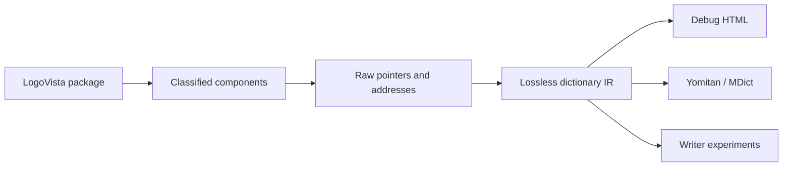

# logovista-tools

`logovista-tools` is a raw-first reverse-engineering toolkit for
LogoVista/SystemSoft SSED dictionary packages.

The project started as an exporter experiment. It is now aimed at a stronger
goal: building a lossless, evidence-backed model of LogoVista dictionaries so
the same understanding can support inspection, extraction, validation,
exporters, and eventually writer experiments.

No dictionary data is included in this repository.



## Status

**Research alpha.** This does not mean "barely works." It means the toolkit
already handles many observed dictionaries, but the model and output schemas
are still allowed to change as more products are tested.

| Layer | Current confidence |
|---|---|
| `SSEDINFO` / `SSEDDATA` expansion | High for observed SSED dictionaries |
| EPWING-like component block mapping | High |
| Body-stream `HONMON.DIC` extraction | High for supported dictionaries |
| Dense HONMON ID-anchor dereferencing | Strong, still corpus-driven |
| `*INDEX.DIC` / `*TITLE.DIC` parsing | High for the current SSED corpus |
| `.uni`, `GA16HALF`, `GA16FULL` gaiji resources | High for observed variants |
| `MENU.DIC`, `COLSCR.DIC`, `PCMDATA.DIC` | High byte coverage for the current SSED corpus |
| Windows / Android / iOS wrappers | Supported per observed package family |
| LVED/WebView2 `main.data` / `.dbc` SQLCipher payloads | Validated for observed OXFPEU4/KQCMPROS packages |
| LogoVista writer support | Not implemented |

The current development direction is:

1. keep package classification raw-first and evidence-backed;
2. count and expose unknowns instead of hiding them;
3. promote the current lossless span JSONL into a documented, stable IR;
4. use exporters and writer experiments as views over that model.

See [Project Status and Roadmap](docs/status.md) for the longer capability list.
The current Windows SSED corpus byte scan covers 169 package targets and
3,497,793,539 expanded `HONMON.DIC` bytes. With the current opcode and text
cell table, every expanded HONMON byte is accounted for: zero unknown controls,
zero unknown bytes, zero invalid JIS cells, and one known final truncated
control byte in `NANDOKU3`. See [Corpus Findings](docs/corpus-findings.md) for
the exact aggregate.

The companion component-forensics pass accounts for observed `MENU.DIC`,
`*TITLE.DIC`, `*INDEX.DIC`, `.uni`, `GA16*`, `COLSCR.DIC`, and `PCMDATA.DIC`
components across the same 169-package corpus. Remaining anomalies are narrow
and explicitly reported: one 3-byte physical index tail, one unknown title
control, one unknown title byte, a few `.uni` trailer bytes, and one dictionary
with in-range but still-unclassified raw audio payloads.

## Install

Use Python 3.10 or newer.

```bash
git clone https://github.com/shoui520/logovista-tools.git
cd logovista-tools
python -m pip install -e .
```

Encrypted Windows body streams require AES support:

```bash
python -m pip install -e ".[crypto]"
```

Verify the CLI:

```bash
logovista-tools --help
```

You can also run without installing:

```bash
PYTHONPATH=src python -m logovista_tools --help
```

## Quick Start

Scan a LogoVista collection:

```bash
logovista-tools scan /path/to/LogoVista
```

For large corpora, add `--jobs N` to corpus-scale commands. `--jobs 0` uses
all CPUs reported by Python:

```bash
logovista-tools audit-honmon /path/to/LogoVista --jobs 0 --out-dir out/honmon-audit
```

Inspect one dictionary catalog:

```bash
logovista-tools info /path/to/DICT/DICT.IDX --all
```

Audit whether `HONMON.DIC` and raw indexes produce readable body data:

```bash
logovista-tools audit-honmon /path/to/LogoVista --out-dir out/honmon-audit
```

Write redacted corpus profiles with index coverage, opcode censuses, and
lossless decode metrics:

```bash
logovista-tools profile /path/to/LogoVista --jobs 0 --out-dir out/profiles
```

Decode every expanded `HONMON.DIC` byte and write redacted coverage reports:

```bash
logovista-tools honmon-bytes /path/to/LogoVista --jobs 0 --out-dir out/honmon-bytes
```

Forensically account for menu, title, index, gaiji, image, and audio
components:

```bash
logovista-tools component-forensics /path/to/LogoVista --jobs 0 --out-dir out/components
```

Dump lossless span JSONL for entry-level reverse engineering:

```bash
logovista-tools dump-ir /path/to/LogoVista --dict HAESPJPN --limit 10 --out-dir out/ir
```

Extract readable body-stream entries:

```bash
logovista-tools entries /path/to/LogoVista --out-dir out/bodies
```

Extract entries with HTML and image-backed gaiji preservation:

```bash
logovista-tools entries /path/to/LogoVista --dict HAESPJPN --image-gaiji --html --out-dir out/html-bodies
```

Inspect Windows side panels, `EXINFO.INI`, and numeric `00000xxx.idx` trees:

```bash
logovista-tools extras /path/to/DICT --out-dir out/extras
```

For dense-HONMON renderer packages, follow raw HONMON IDs into renderer/app DB
rows:

```bash
logovista-tools rendererdb /path/to/DICT --out-dir out/rendererdb
```

Inspect modern LVED/WebView2 SQLCipher packages such as OXFPEU4/KQCMPROS:

```bash
logovista-tools lved /path/to/OXFPEU4 --dict-id 750 --dict-code OXFPEU4 --json
```

The full command reference lives in [docs/commands.md](docs/commands.md).

## Documentation Map

### User and Project Docs

| Page | Purpose |
|---|---|
| [CLI Command Reference](docs/commands.md) | All current commands and options. |
| [Project Status and Roadmap](docs/status.md) | What works, what is experimental, and where the project is going. |
| [Corpus Findings](docs/corpus-findings.md) | Observed behavior from real dictionaries and platform comparisons. |
| [Legal and Data Policy](docs/legal.md) | Repository scope and data-handling policy. |

### Format Notes

| Page | Covers |
|---|---|
| [Format Notes Index](spec/README.md) | Overview of the spec-style notes. |
| [Package Layers](spec/package-layers.md) | Raw core files and iOS/Android/Windows wrappers. |
| [LV-IR v0 Draft](spec/lv-ir-v0.md) | Versioned decoded dictionary model for writer/exporter work. |
| [SSED Container](spec/ssed-container.md) | `SSEDINFO`, `SSEDDATA`, encryption, and expansion. |
| [Text Streams and Body Storage](spec/text-streams.md) | `HONMON.DIC`, entry slicing, dense HONMON, `DictFULLDB`, outliers. |
| [Menus, Titles, and Indexes](spec/menus-titles-indexes.md) | `MENU.DIC`, `*TITLE.DIC`, and `*INDEX.DIC`. |
| [Gaiji, Images, and Media](spec/gaiji-media.md) | `.uni`, `GA16*`, package images, `COLSCR.DIC`, `PCMDATA.DIC`. |
| [LVED SQLCipher Packages](spec/lved-main-data.md) | Modern WebView2 `main.data` / `.dbc` package family. |
| [Confidence Levels](spec/confidence.md) | How reverse-engineered claims are labeled. |

## Core Model

The stable idea is that a dictionary package has a raw core and optional
platform wrappers. Not every product ships every component.

```text
DICT.IDX
HONMON.DIC
MENU.DIC
KWTITLE.DIC / KWINDEX.DIC
FKTITLE.DIC / FKINDEX.DIC
FHTITLE.DIC / FHINDEX.DIC
BKTITLE.DIC / BKINDEX.DIC
COLSCR.DIC / PCMDATA.DIC
GA16HALF / GA16FULL
DICT.uni / DICT.UNI
```

Platform packages add their own wrapper material:

```text
iOS       DictList.plist, Gaiji.plist, GaijiS.plist, img/, html/, *.sql
Android   *.db, resource/conf.ini, resource/kmkimges/, manual/, innerdata/
Windows   EXINFO.INI, HC*.dll, Templates/, HANREI/, vlpljbl*, 00000xxx.idx
LVED      main.data / *.dbc, WebView2 viewer files, SQLCipher runtime
```

The raw core is the main reverse-engineering target. SQLite databases, renderer
sidecars, and app caches may be validation evidence, search caches, or full
body payloads. They are not treated as replacements for the raw
address/pointer model.

Modern LVED/WebView2 products are a separate package family. In observed
OXFPEU4/KQCMPROS packages, `main.data` or `.dbc` is a SQLCipher database rather
than an SSED/HONMON stream. The toolkit classifies and validates those payloads
separately instead of forcing them into the SSED model. The SQLCipher key
derivation is documented in [LVED SQLCipher Packages](spec/lved-main-data.md)
and implemented in code; per-product final keys and serials are not repository
artifacts.

## Development

Run tests:

```bash
pytest -q
```

The repository intentionally does not include proprietary dictionary files,
decrypted databases, generated full-body exports, extracted media, vendor DLLs,
or generated gaiji assets.

When adding support for a new dictionary family, prefer:

1. classify the package and components;
2. preserve raw addresses and bytes in reports;
3. add measurable unknown counts;
4. document confidence and corpus evidence;
5. add synthetic tests for parser behavior.
